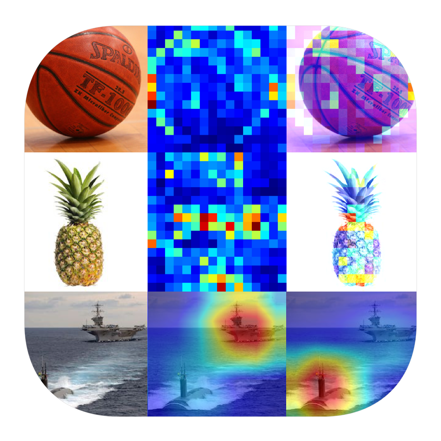
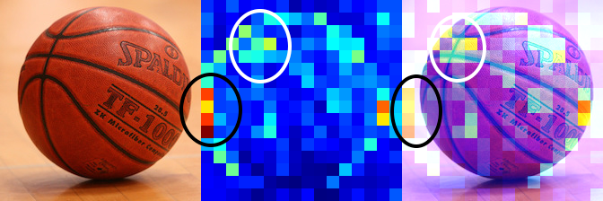
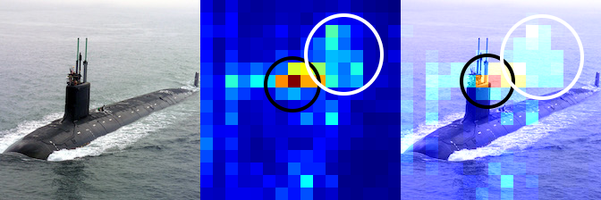
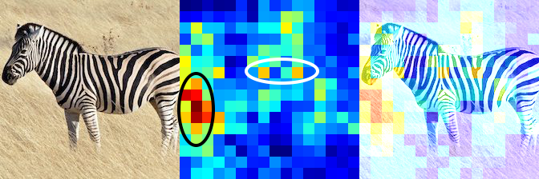

<h3 align="center">
  
</h3>

# CNN Explainer

CNN Explainer is PyTorch based project that aims to make CNN's predictions explainable.

Check the corresponding article:
 
[CNN Explainer - Interpreting Convolutional Neural Networks (1/N) Generating Area Importance Heatmaps with Occlusions](https://gsurma.medium.com/cnn-explainer-interpreting-convolutional-neural-networks-1-n-e81c62cbb660)

## Area Importance Heatmaps with Occlusions
[Notebook](cnn_area_importance_heatmaps.ipynb)

---

---

---

---

## Weights Visualizations
WIP

## Activations Maps
WIP

## Author

**Greg (Grzegorz) Surma**

[**PORTFOLIO**](https://gsurma.github.io)

[**GITHUB**](https://github.com/gsurma)

[**BLOG**](https://medium.com/@gsurma)

