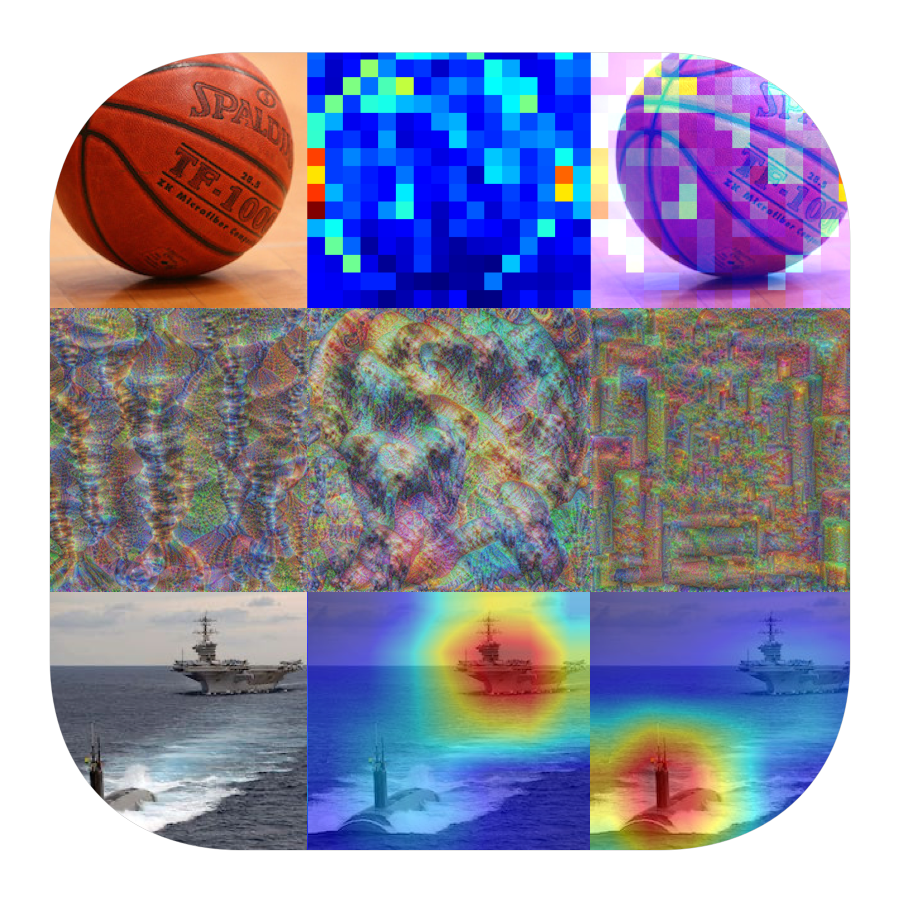

<h3 align="center">
  
</h3>

# CNN Explainer

CNN Explainer is PyTorch based project that aims to make CNN's predictions explainable.

Check the corresponding articles:
 
[CNN Explainer - Interpreting Convolutional Neural Networks (1/N) Generating Area Importance Heatmaps with Occlusions](https://gsurma.medium.com/cnn-explainer-interpreting-convolutional-neural-networks-1-n-e81c62cbb660)
 
[CNN Explainer - Interpreting Convolutional Neural Networks (2/N) Visualizing Gradient Weighted Class Activations with GradCAM](https://gsurma.medium.com/cnn-explainer-interpreting-convolutional-neural-networks-2-n-18e40a03eae2)
 
[CNN Explainer - Interpreting Convolutional Neural Networks (3/N) Visualizing Boosted Convolutional Features](https://gsurma.medium.com/cnn-explainer-interpreting-convolutional-neural-networks-3-n-de0b348caff)
 

## Boosted Features Visualizations
[Notebook](cnn_features_visualizations.ipynb)

---

---

---

---

---

---

---

---

---

---

---

## GradCAM Heatmaps
[Notebook](cnn_gradcam_heatmaps.ipynb)

Submarine
 

 

Aircraft Carrier
 

## Area Importance Heatmaps with Occlusions
[Notebook](cnn_area_importance_heatmaps.ipynb)

---

---

---

---

## Author

**Greg (Grzegorz) Surma**

[**PORTFOLIO**](https://gsurma.github.io)

[**GITHUB**](https://github.com/gsurma)

[**BLOG**](https://medium.com/@gsurma)

